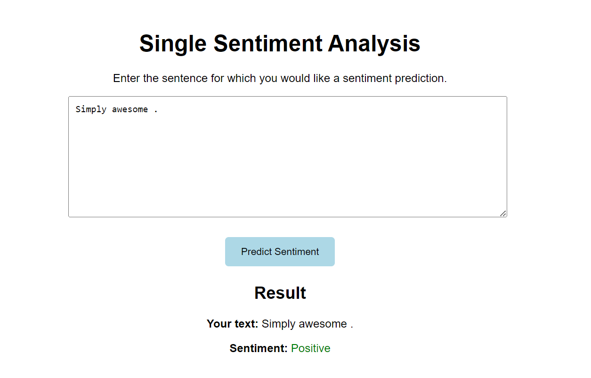
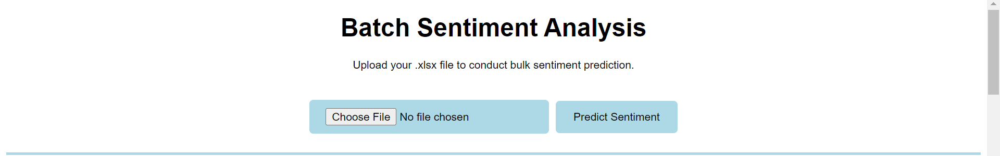
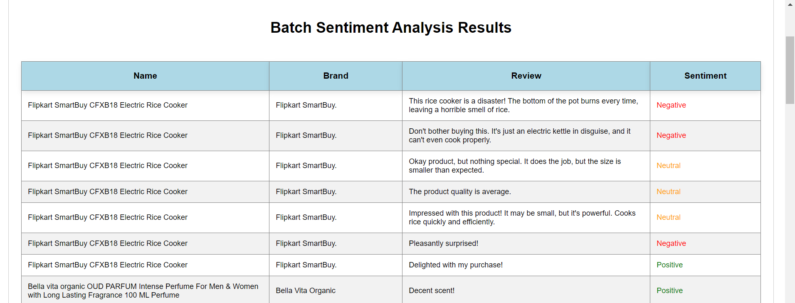
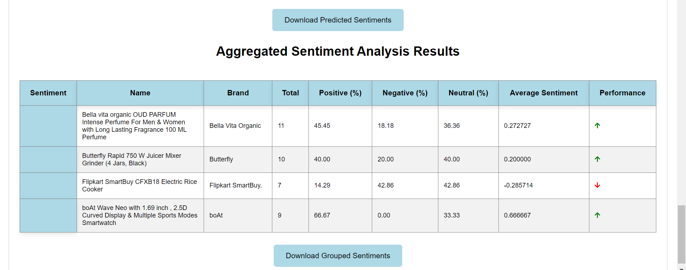

# Sentiment_Analysis_using_LSTM
**Title:** Product Sentiment Analyzer

**Dataset:** Flipkart Sentiment Dataset(Kaggle)
## Description:
The Product Sentiment Analyzer is a Python-based web application designed for sentiment analysis of product reviews. This project aims to provide e-commerce platforms with valuable insights into customer sentiments towards their products, helping them make data-driven decisions to enhance product offerings and improve overall customer satisfaction. The sentiment analysis model classifies product reviews into positive, negative, or neutral sentiments, allowing businesses to identify product strengths, weaknesses, and emerging trends.

## Key Features:

- **User-Friendly Interface:** The web-based interface allows users to input individual product reviews or upload a file containing multiple reviews for sentiment analysis.
- **Single and Batch Prediction:**
  
 **Single Prediction:**
  - 𝘔𝘢𝘯𝘶𝘢𝘭𝘭𝘺 𝘪𝘯𝘱𝘶𝘵 𝘱𝘳𝘰𝘥𝘶𝘤𝘵 𝘳𝘦𝘷𝘪𝘦𝘸𝘴 𝘢𝘯𝘥 𝘨𝘦𝘵 𝘪𝘯𝘴𝘵𝘢𝘯𝘵 𝘴𝘦𝘯𝘵𝘪𝘮𝘦𝘯𝘵 𝘢𝘯𝘢𝘭𝘺𝘴𝘪𝘴 𝘳𝘦𝘴𝘶𝘭𝘵𝘴 𝘸𝘪𝘵𝘩 𝘫𝘶𝘴𝘵 𝘢 𝘧𝘦𝘸 𝘤𝘭𝘪𝘤𝘬𝘴.
  
  **Batch Prediction:**
  - 𝘜𝘱𝘭𝘰𝘢𝘥 𝘧𝘪𝘭𝘦𝘴 𝘤𝘰𝘯𝘵𝘢𝘪𝘯𝘪𝘯𝘨 𝘮𝘶𝘭𝘵𝘪𝘱𝘭𝘦 𝘳𝘦𝘷𝘪𝘦𝘸𝘴 𝘧𝘰𝘳 𝘴𝘪𝘮𝘶𝘭𝘵𝘢𝘯𝘦𝘰𝘶𝘴 𝘢𝘯𝘢𝘭𝘺𝘴𝘪𝘴, 𝘴𝘵𝘳𝘦𝘢𝘮𝘭𝘪𝘯𝘪𝘯𝘨 𝘵𝘩𝘦 𝘱𝘳𝘰𝘤𝘦𝘴𝘴 𝘢𝘯𝘥 𝘴𝘢𝘷𝘪𝘯𝘨 𝘵𝘪𝘮𝘦.  𝘈𝘥𝘥𝘪𝘵𝘪𝘰𝘯𝘢𝘭𝘭𝘺, 𝘵𝘩𝘦 𝘪𝘯𝘵𝘦𝘳𝘧𝘢𝘤𝘦 𝘱𝘳𝘰𝘷𝘪𝘥𝘦𝘴 𝘢𝘯 𝘰𝘷𝘦𝘳𝘢𝘭𝘭 𝘴𝘶𝘮𝘮𝘢𝘳𝘺 𝘰𝘧 𝘵𝘩𝘦 𝘴𝘦𝘯𝘵𝘪𝘮𝘦𝘯𝘵 𝘢𝘯𝘢𝘭𝘺𝘴𝘪𝘴 𝘳𝘦𝘴𝘶𝘭𝘵𝘴. 𝘛𝘩𝘪𝘴 𝘴𝘶𝘮𝘮𝘢𝘳𝘺 𝘪𝘯𝘤𝘭𝘶𝘥𝘦𝘴 𝘬𝘦𝘺 𝘮𝘦𝘵𝘳𝘪𝘤𝘴 𝘴𝘶𝘤𝘩 𝘢𝘴 𝘵𝘩𝘦 𝘱𝘦𝘳𝘤𝘦𝘯𝘵𝘢𝘨𝘦 𝘰𝘧 𝘱𝘰𝘴𝘪𝘵𝘪𝘷𝘦, 𝘯𝘦𝘨𝘢𝘵𝘪𝘷𝘦, 𝘢𝘯𝘥 𝘯𝘦𝘶𝘵𝘳𝘢𝘭 𝘴𝘦𝘯𝘵𝘪𝘮𝘦𝘯𝘵𝘴 𝘰𝘣𝘴𝘦𝘳𝘷𝘦𝘥 𝘪𝘯 𝘵𝘩𝘦 𝘥𝘢𝘵𝘢𝘴𝘦𝘵. 𝘐𝘵 𝘢𝘭𝘴𝘰 𝘰𝘧𝘧𝘦𝘳𝘴 𝘪𝘯𝘴𝘪𝘨𝘩𝘵𝘴 𝘪𝘯𝘵𝘰 𝘵𝘩𝘦 𝘰𝘷𝘦𝘳𝘢𝘭𝘭 𝘴𝘦𝘯𝘵𝘪𝘮𝘦𝘯𝘵 𝘵𝘳𝘦𝘯𝘥, 𝘩𝘦𝘭𝘱𝘪𝘯𝘨 𝘶𝘴𝘦𝘳𝘴 𝘲𝘶𝘪𝘤𝘬𝘭𝘺 𝘢𝘴𝘴𝘦𝘴𝘴 𝘵𝘩𝘦 𝘨𝘦𝘯𝘦𝘳𝘢𝘭 𝘴𝘦𝘯𝘵𝘪𝘮𝘦𝘯𝘵 𝘥𝘪𝘴𝘵𝘳𝘪𝘣𝘶𝘵𝘪𝘰𝘯 𝘢𝘯𝘥 𝘱𝘦𝘳𝘧𝘰𝘳𝘮𝘢𝘯𝘤𝘦 𝘰𝘧 𝘵𝘩𝘦 𝘢𝘯𝘢𝘭𝘺𝘻𝘦𝘥 𝘳𝘦𝘷𝘪𝘦𝘸𝘴.

- **Sentiment Classification:** Utilizes machine learning and natural language processing techniques to classify product sentiments based on textual reviews.

- **Performance Metrics:** Provides insights into overall product performance, including sentiment scores, sentiment trends, and performance indicators for each product.

## Technologies Used:
**Python:** Backend development, data preprocessing, and model building.

**Flask:** Web framework for building the user interface and handling HTTP requests.

**scikit-learn:** Machine learning library for implementing sentiment analysis algorithms.

**TensorFlow or Keras:** Deep learning frameworks for building and training sentiment analysis models.

**HTML/CSS:** Frontend development for creating interactive user interfaces.
